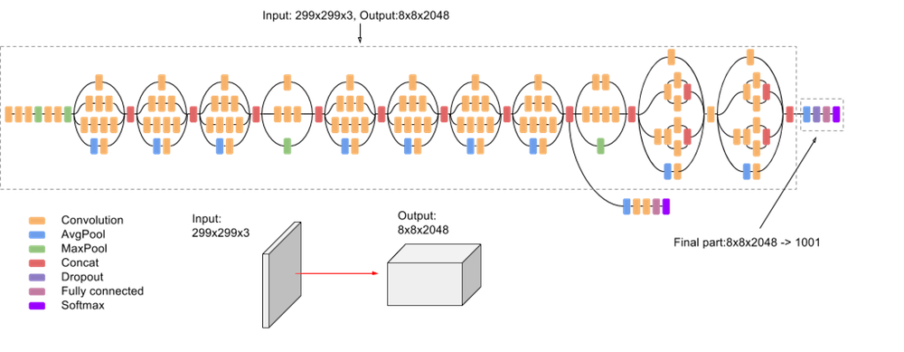
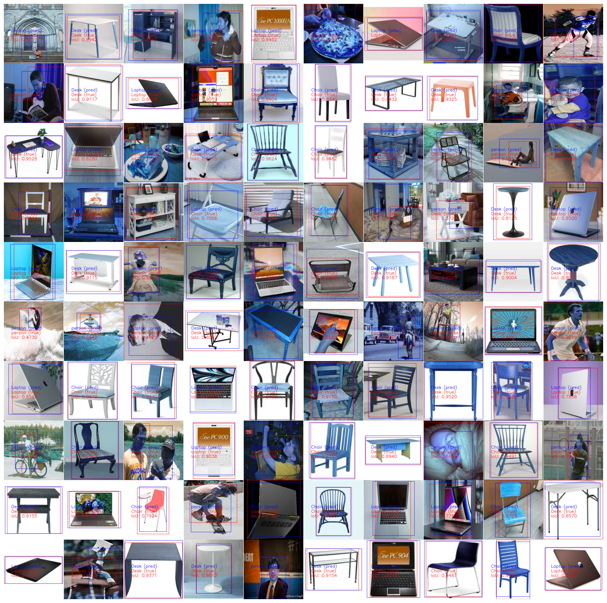

# Object-Localization-and-Classification

## <div>Introduction</div>
<div>
    This project aims to develop a system for object localization and classification using the Inception-v3 model. The system is designed to identify and locate objects within images, which can be utilized in various applications such as image search engines, automated surveillance, and robotics.
</div>
<br>
</a>

## Features
- High accuracy object classification using Inception-v3
- Object localization within images
- Support for various image formats
- Visualization of localization and classification results

## Installation

1. Clone the repository:
    ```bash
    git clone https://github.com/KevinElevenVN/Vehicle-Detection-and-Tracking-using-YOLOv8.git
    cd Vehicle-Detection-and-Tracking-using-YOLOv8
    ```

2. Install the required dependencies:
    ```bash
    pip install -r requirements.txt
    ```

## Datasets
To use the custom dataset for this project, please download it from the following Google Drive link:

[Download Dataset](https://drive.google.com/drive/folders/17gH7V77CQ9TP8NqOSK9iToDXGio-ErwW?usp=sharing)
    
## Results
|               | Mean IoU | Accuracy |
| ------------- | -------- | -------- |
| Inception-V3  |**0.7363**|**0.9362**|

<br>
</a>

## License
This project is licensed under the MIT License. See the [LICENSE](LICENSE) file for details.

## Acknowledgements
- [Inception-v3](https://github.com/pytorch/vision/blob/main/torchvision/models/inception.py)
